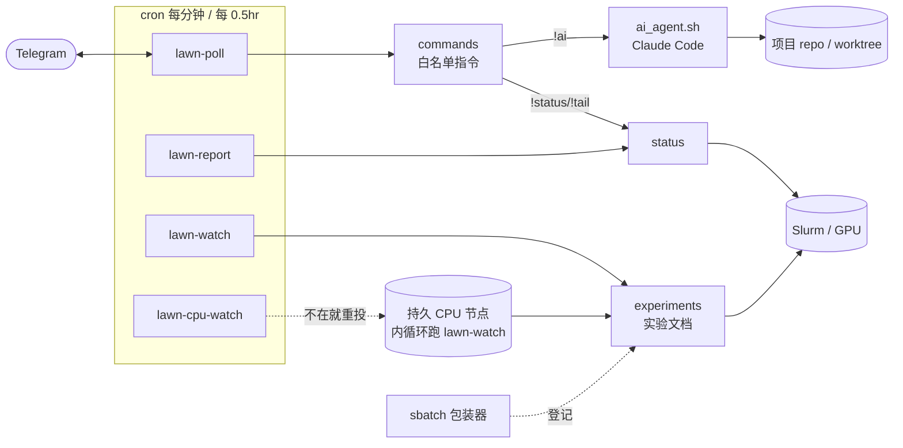

# lawn

通过 Telegram 远程指挥跑在登录节点 / 集群上的 Claude Code agent，并推送 GPU / Slurm / 实验状态。无常驻进程，靠 cron 轮询，纯 Python 标准库（无第三方依赖）。

## 能做什么

- **远程指挥**：在 Telegram 里发 `!ai <自然语言>`，在指定项目后台跑 Claude Code 改代码。
- **状态推送**：Slurm 作业（含进度 / ETA）、GPU、最新结果，自动汇总到 Telegram。
- **实验看护**：任何终端的 `sbatch` 提交自动登记成实验文档，定期巡检，异常可自动修。
- **自愈**：登录节点若是 k8s pod（crontab 只是本地状态，pod 重建即丢失），可选把高频轮询挪到持久的 Slurm CPU-only 分配上，不依赖登录节点存活。

## 架构



Telegram 是唯一人机入口，几个 cron 脚本各管一摊（轮询指令 / 状态汇总 / 实验看护 / CPU 看护节点自愈），最终落到 Slurm 或项目仓库上；`sbatch` 包装器旁路把每次提交登记成实验文档。

## 快速开始

1. 建 `~/.config/lawn.env`：

   ```bash
   TELEGRAM_BOT_TOKEN="..."
   TELEGRAM_CHAT_ID="..."            # 回复 / 推送发到这个 chat
   TELEGRAM_ALLOWED_USER_ID="..."    # 只响应这些用户 ID(逗号分隔可多个)
   ```

2. 挂 cron（务必用绝对路径的系统 python 入口，cron 不走 login shell）：

   ```cron
   * * * * * /path/to/lawn/bin/lawn-poll        # 轮询并执行指令
   */30 * * * * /path/to/lawn/bin/lawn-report    # 状态汇总 + 推送
   */30 * * * * /path/to/lawn/bin/lawn-watch     # 实验看护
   ```

3. （可选）装 `sbatch` 包装器，让所有提交自动登记成实验：

   ```bash
   bin/lawn-sbatch install
   ```

4. （可选，登录节点是 k8s pod 时建议）挂 CPU 看护节点自愈，见
   [COMMANDS.md#CPU-看护节点](COMMANDS.md#cpu-看护节点)：

   ```cron
   */30 * * * * LAWN_CPU_ACCOUNT=<your-account> LAWN_CPU_INTERVAL=900 /path/to/lawn/bin/lawn-cpu-watch
   ```

项目默认靠**动态发现**免手写清单（扫描 lawn 父目录下最近有 git 提交的仓库）。

## 常用指令

```
!status / !jobs   Slurm 作业(含进度/ETA) + GPU + 最新结果
!tail <jobid>     该作业日志最后 40 行
!projects         列出可操作项目
!use <项目>       切换当前项目
!ai <自然语言>    在当前项目里跑 Claude Code 改代码
!help             指令列表
```

完整参考（模块结构、命令行入口、项目配置、实验登记与看护、CPU 看护节点自愈、进度/ETA 说明）见 [COMMANDS.md](COMMANDS.md)。
